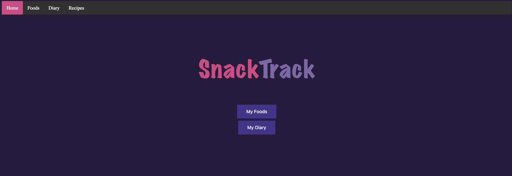
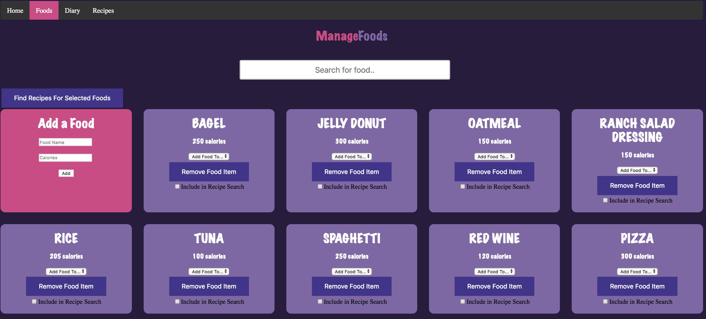
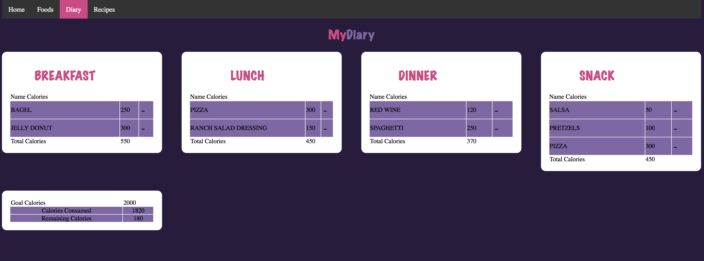
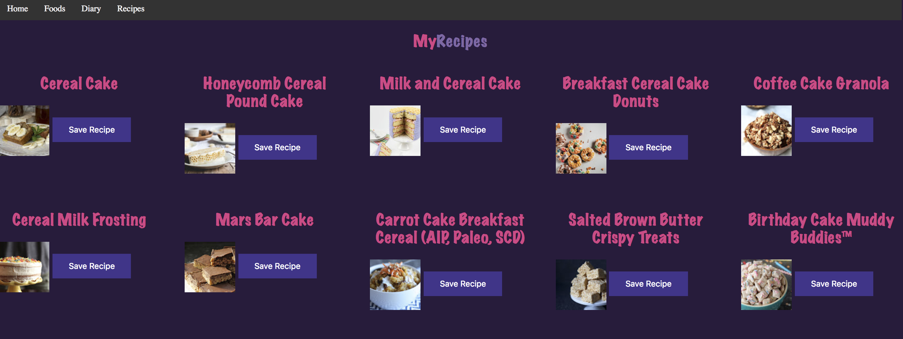
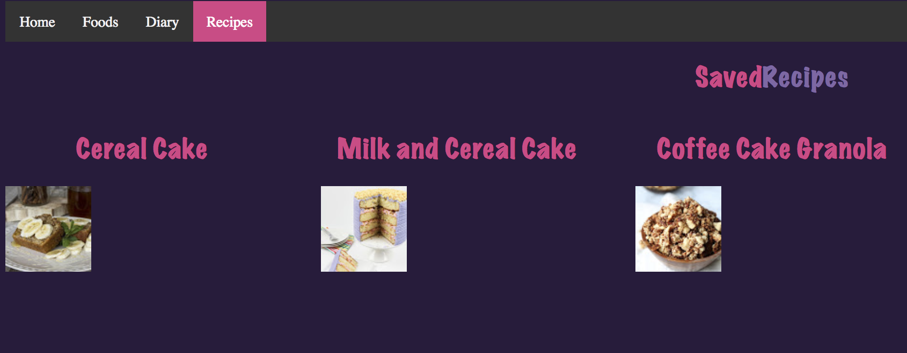
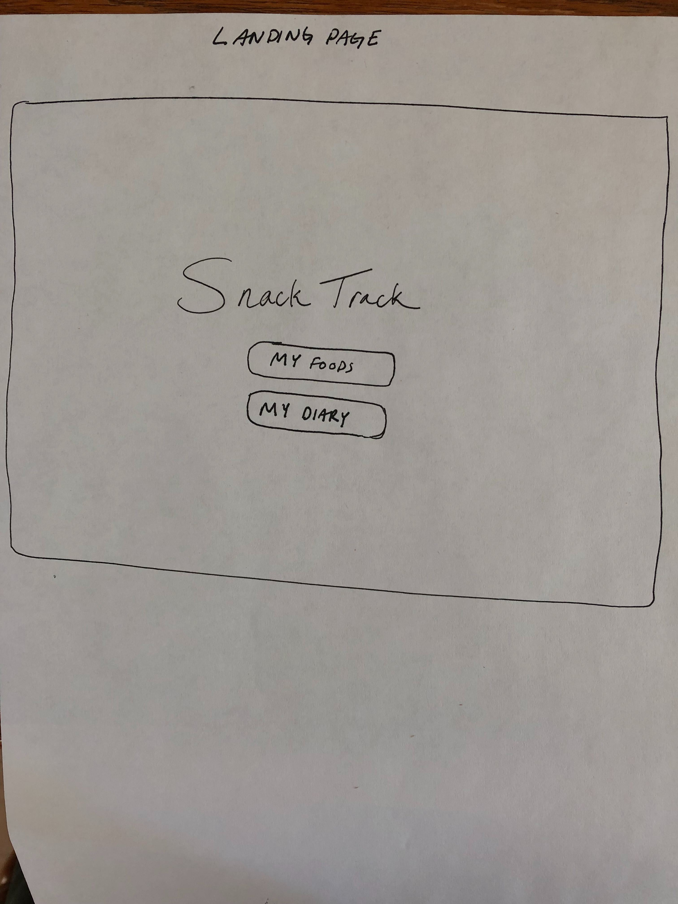
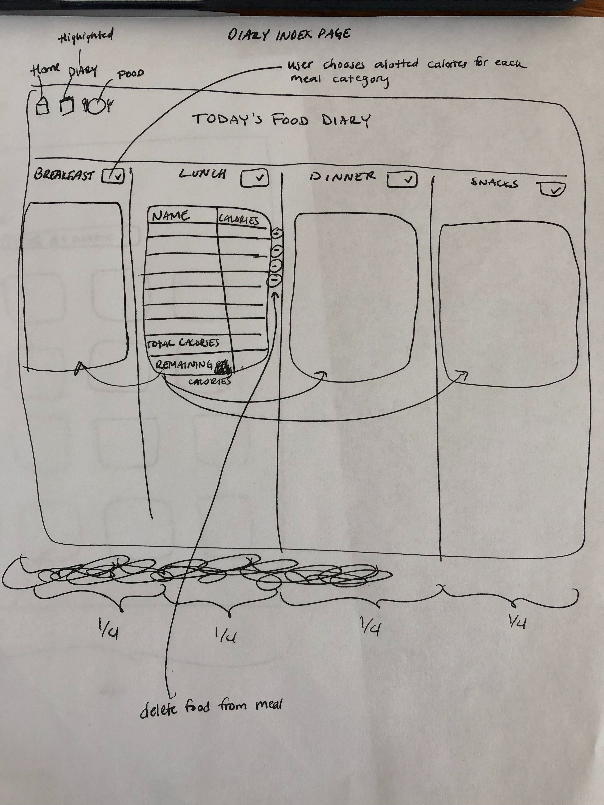
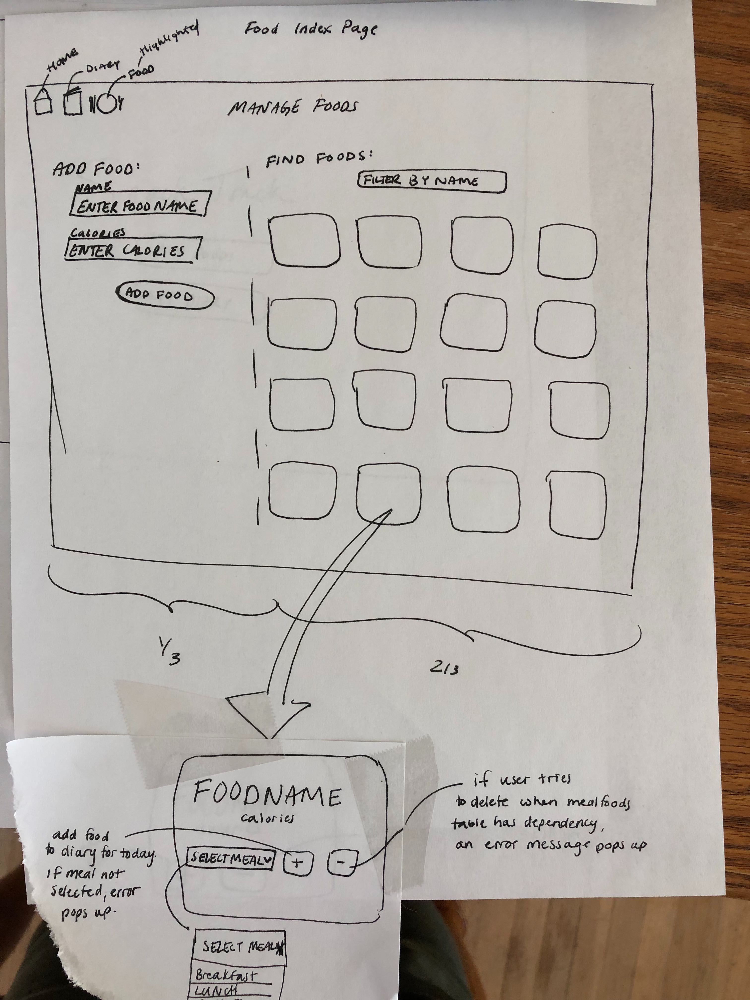

# SnackTrack Front End

This application is written in javascript and it uses the Snack Track API that was also built in Javascript. 
You can find the backend here: https://github.com/mstang15/quantified-self-be

<h1>App Overview</h1>

When a user visits the app, they see a welcome screen that allows the user to navigate to both the foods index page and the diary page.
When a user goes to the food index page, they can see all foods that are already in the database. They are able to add more foods with their calories, as well as delete foods that are in the food list. Users can use a dynamic search to find the food that they wish to add to a meal. In order to add a food to a meal, a user can select the meal from a drop down menu and this will automatically add the food to the diary. Users are also able to select the food with a checkbox and then click "Find recipes for selected foods" to find recipes that were pulled using the Yummly API. 
When a user goes to the diary page, they can see the breakdown of all of their meals, the foods included, and a goals overview for calories set, and calories remaining for that day. Users have the ability to delete foods from the meal tables. 
When a user visits the Recipe tab, they can see any and all recipes that they have saved while they were using the browser. 

Welcome screen:

)
 
Food index:

Food Diary:

After selecting cake and cereal (because that might make a great recipe that we've never tried before!), and press the "Find Recipes for Selected Foods" button, the user is redirected to 10 recipes that match their search words. Users are able to click on the picture of the recipe, and then they will be taken to a yummly web page to view it.

If a user decides to save three recipes, they can click the "Save Recipe" button and then they are able to visit their Recipe tab in the nav bar to see the recipes that they had saved. The picture that displays for the favorites is also a link right to yummly. 

<h2>Wireframe</h2>

## Set Up
This app is currently only working locally, so you must also run the backend locally. Visit https://github.com/mstang15/quantified-self-be and follow the following directions: 
1. git clone <paste repo link for quantified_self backend>
2. cd quantified_self
3. npm install 
4. npm start 

Now that the backend is running, set up your front end and get it running by following the directions below: 
1. git clone <paste repo link for quantified-self frontend>
2. cd quantified-self-fe
3. npm install
4. npm run dev
5. You can visit localhost:8080 to see the app running locally

## Built With

* [JavaScript](https://www.javascript.com/)
* [jQuery](https://jquery.com/)
* [Express](https://expressjs.com/)
* [Mocha](https://mochajs.org/)
* [Chai](https://chaijs.com/)

